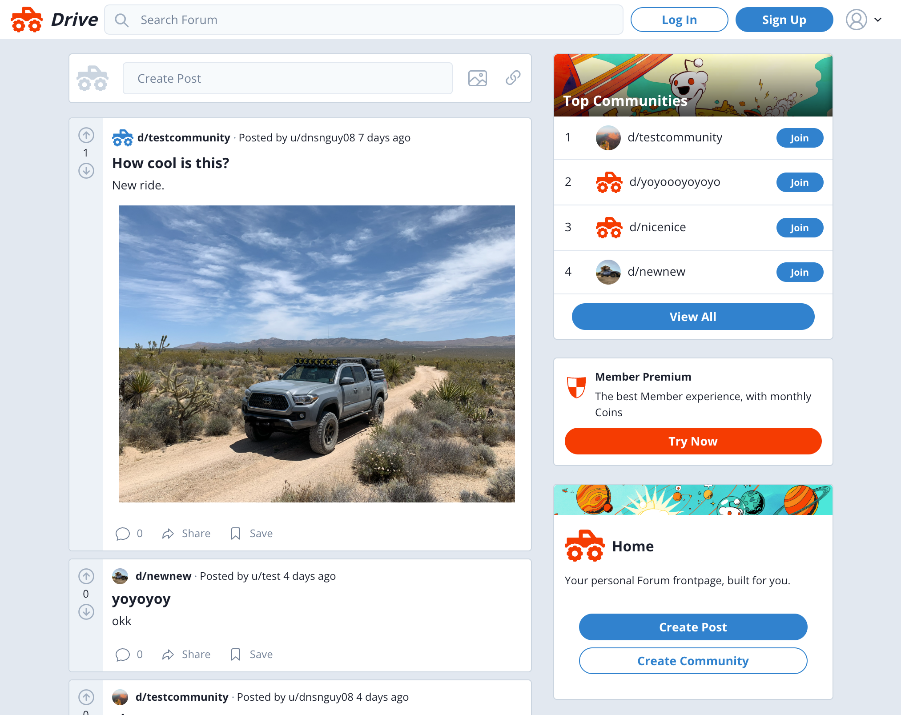

# Drive! Overlanding Forum

## Table of contents

- [Overview](#overview)
  - [The challenge](#the-challenge)
  - [User Story](#user-story)
  - [Acceptance Criteria](#acceptance-criteria)
  - [Links](#links)
- [Process](#process)
  - [Built with](#built-with)
  - [Motivation](#motivation)

## Overview

### The challenge

Create a reddit-clone/forum for members to share stories, ideas, news relating to travel / overlanding topics.

### User Story

    AS A overlanding enthusiast 
    I WANT to have a forum
    SO THAT I can connect with other members and share interests

### Acceptance Criteria

    App should allow users to:
    Sign Up/Login to their accounts
    Create & Update communities
    Post in a given community
    Comment on a given post
    Upvote or Downvote and given post
    App is responsive

### Screenshot

### Links

- [Github URL here](https://github.com/dnsnguy08/reddit_clone)
- [Live](https://reddit-clone-five-liart.vercel.app/)

## Process

### Built with
- React
- Next.js
- Typescript
- Firebase
- Chakra UI

### Motivation
I wanted to build a Full Stack CRUD app with server side rendering using Next.js and Typescript.

## License
MIT License

Copyright (c) [2023] [Dennis Nguyen](https://github.com/dnsnguy08)

Permission is hereby granted, free of charge, to any person obtaining a copy
of this software and associated documentation files (the "Software"), to deal
in the Software without restriction, including without limitation the rights
to use, copy, modify, merge, publish, distribute, sublicense, and/or sell
copies of the Software, and to permit persons to whom the Software is
furnished to do so, subject to the following conditions:

The above copyright notice and this permission notice shall be included in all
copies or substantial portions of the Software.

THE SOFTWARE IS PROVIDED "AS IS", WITHOUT WARRANTY OF ANY KIND, EXPRESS OR
IMPLIED, INCLUDING BUT NOT LIMITED TO THE WARRANTIES OF MERCHANTABILITY,
FITNESS FOR A PARTICULAR PURPOSE AND NONINFRINGEMENT. IN NO EVENT SHALL THE
AUTHORS OR COPYRIGHT HOLDERS BE LIABLE FOR ANY CLAIM, DAMAGES OR OTHER
LIABILITY, WHETHER IN AN ACTION OF CONTRACT, TORT OR OTHERWISE, ARISING FROM,
OUT OF OR IN CONNECTION WITH THE SOFTWARE OR THE USE OR OTHER DEALINGS IN THE
SOFTWARE.
